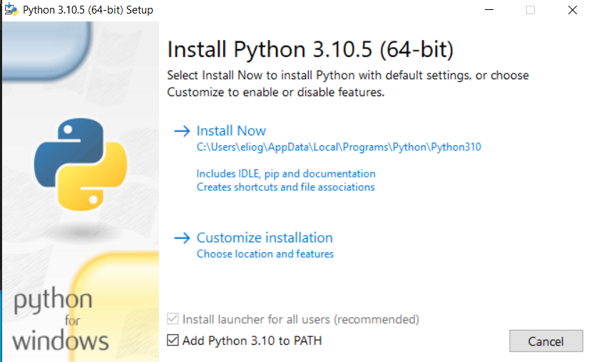
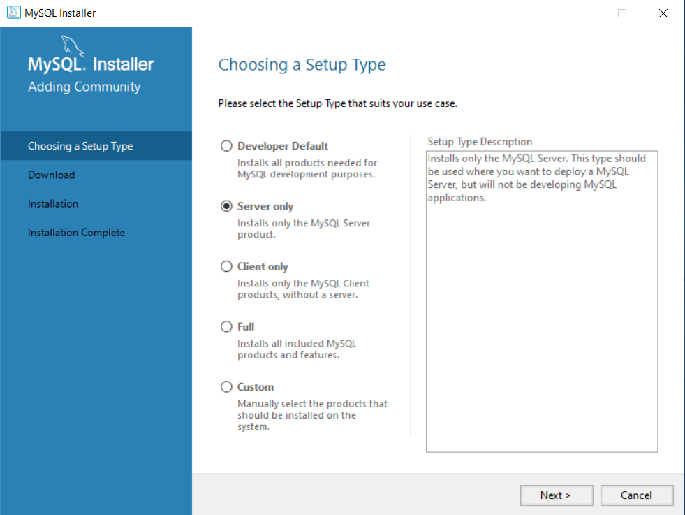
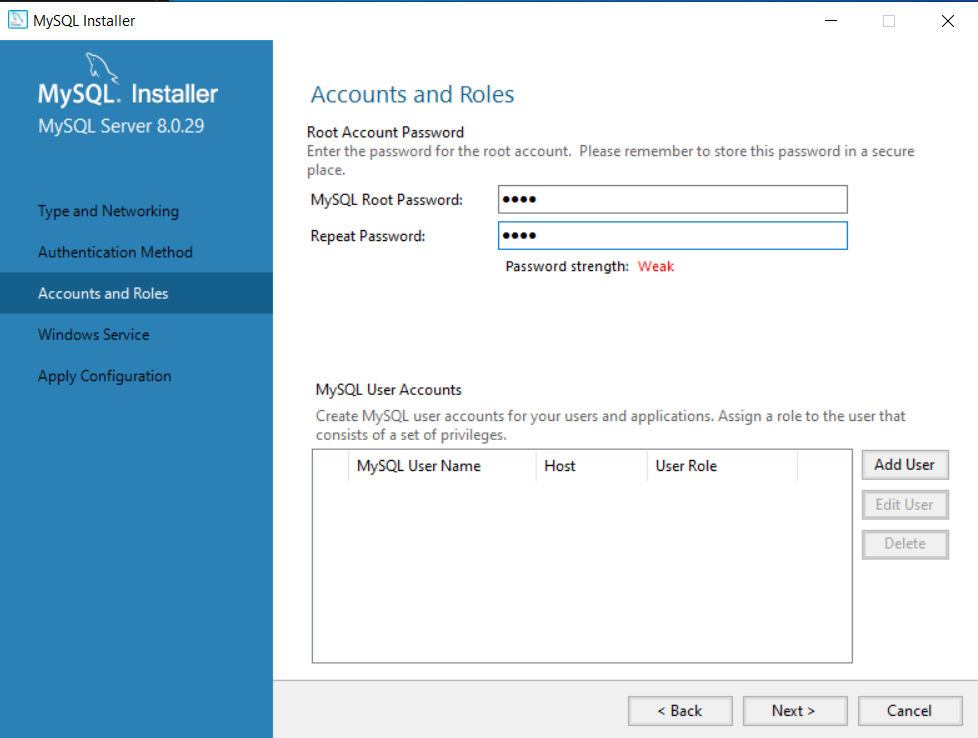

# Sistemi Distribuiti - Progetto "Sistema Bancario"
## Indice
Installazioni:
- [Installazione Windows](#Installazione_Windows)
- [Installazione Linux](#Installazione_Linux)
- [Utilizzo Applicazione e API](#Utilizzo_dell'applicazione_e_API)
- [Autori e Info](#Autori)

## Installazione_Windows
Questa è la guida per l'installazione del progetto "Sistema Bancario" in un ambiente __Windows__.

## Prima di iniziare
- L'applicazione è stata testata su una __macchina  64 bit__ con __Windows 10 21H2__ e __Windows 11 21H2__. Nel caso si stia utilizzando una __macchina 32 bit la procedura di installazione potrebbe variare leggermente (nei download necessari si scelga 32 bit)__.
- Si consiglia di __riavviare__ la macchina dopo ogni installazione.
- Per evitare problemi di permessi, si utilizzi il CMD (o Shell) con i __permessi di amministratore__.

## Guida per l'installazione

### Passo 1: Download e Setup di Python
- Scaricare __Python 3.10.5__ dal seguente link: https://www.python.org/downloads/windows/. 
- Selezionare la versione __Windows Installer__ per la vostra macchina (64 o 32 bit). 
- Procedere con una normale installazione e selezionare la spunta ove l'installazione richiede __l'aggiunta di Python nelle variabili di ambiente di sistema__ (Add Python 3.10 to PATH).



- Aprire il __CMD__ per verificare l'installazione, digitare quindi i seguenti comandi:

``` bat
python

pip help
```

- Nel caso il comando __pip__ non venga riconosciuto, scaricare __PIP__ dal seguente link: https://bootstrap.pypa.io/get-pip.py e successivamente aprire nel __CMD__ la cartella dove è stato salvato il file. Si esegua il seguente comando:

``` bat
python get-pip.py
```

- Nel caso __python__ non venga riconosciuto, si raccomanda si riavviare il computer o riprovare l'installazione __aggiungendo python alle variabili d'ambiente di sistema__.

### Passo 2: Download e Setup di MySQL

- Scaricare __MySQL dal seguente link__: https://dev.mysql.com/downloads/file/?id=511552
- Procedere con l'installazione selezionando __Server Only__



- Si proceda seguendo l'installer, quindi premendo Next e Execute per ogni prompt fino ad arrivare al seguente: Si inserisca due volte la password __root__.



- Si proceda con la conclusione dell'installazione attraverso i bottoni __Next__ o __Execute__.
- Eseguire il file .bat __come Amministratore "startMySQL.bat"__ recuperabile nella cartella "Installazione" della cartella del progetto. Inserire __"root"__ nella richiesta di input del __CMD__.
- Copiare e incollare il contenuto del file __"banca.sql"__ (riportato anche qui sotto) nel __CMD__ aperto in precedenza dal file __"startMySQL.bat"__.

```sql
CREATE DATABASE IF NOT EXISTS banca;

USE banca;

CREATE TABLE `account` (
  `account_id` varchar(20) PRIMARY KEY,
  `name` varchar(40) NOT NULL,
  `surname` varchar(40) NOT NULL,
  `saldo` decimal(24,2) NOT NULL DEFAULT 0.00
);

CREATE TABLE `transazioni` (
  `transactionId` varchar(36) PRIMARY KEY,
  `from` varchar(20) NOT NULL,
  `to` varchar(20) NOT NULL,
  `amount` decimal(24,2) NOT NULL,
  `diverted` boolean NOT NULL DEFAULT 0,
  `date` datetime NOT NULL DEFAULT CURRENT_TIMESTAMP
);

```

- __Importante__: Nel caso in cui l'installazione di MySQL sia stata effettuata in un path differente dal seguente: "C:/Program Files/MySQL/MySQL Server 8.0/bin", allora si sostituisca, aprendo il file .bat con un editor testuale, il path presente con quello selezionato durante l'installazione.

### Passo 3: Installazione dei package necessari

Per l'installazione dei package necessari all'applicazione, si eseguano in successione i seguenti comandi nel __CMD__:

```bat
pip install mysqlclient

pip install uuid

pip install shortuuid

pip install flask
```

### Passo Step 4: Avvio dell'Applicazione

- Aprire un __CMD__ nella cartella principale del progetto, ovvero dove è visualizzabile il file app.py ed eseguire: 

```shell
set FLASK_APP = app

python -m flask run
```

- L'applicazione verrà avviata ogni volta che verrà eseguito il secondo comando qui in alto. Per fermare l'applicazione si prema CTRL+C nel __CMD__. 
- L'applicazione sarà quindi disponibile all'indirizzo mostrato dal __CMD__ (ovvero localhost con porta 5000).
- Utilizzare http e __non__ https.
- Si raccomanda di popolare il database con dei dati per provare tutte le funzionalità dell'applicazione.

<hr>

## Installazione_Linux
Questa è la guida per l'installazione del progetto "Sistema Bancario" in un ambiente __Linux__.

## Prima di iniziare
- L'applicazione è stata testata su una __macchina  64 bit__ utilizzando __Ubuntu 22.04 LTS__. Nel caso si stia utilizzando una __macchina 32 bit la procedura di installazione non è stata testata__.
- Si consiglia di __riavviare__ la macchina dopo ogni installazione.
- Per evitare problemi di permessi, si eseguano i comandi come __sudo__.

## Guida per l'installazione

### Passo 1: Download e Setup di Python e Pip
- Aprire un terminale ed eseguire i seguenti comandi:

```bash
sudo apt update

sudo apt-get install python3

sudo apt install python3-pip

sudo apt-get install python3-dev default-libmysqlclient-dev build-essential
```

### Passo 2: Installazione dei package necessari
- Sempre dal __Terminale__ eseguire i seguenti comandi dopo aver installato __Python__ e __pip__:

```bash
pip3 install flask

pip3 install mysqlclient

pip3 install uuid

pip3 install shortuuid
```

### Passo 3: Download e Setup di MySQL
- Eseguire il comando di download ed installazione di __MySQL__:

```bash
sudo apt-get install mysql-server
```

- Entrare nella __Shell di MySQL__ con il comando:

```bash
sudo mysql
```

- Eseguire la seguente istruzione SQL per impostare la password dell'utente __root__ con '__root__' e chiudere la Shell di MySQL con __\q__:

```sql
ALTER USER 'root'@'localhost' IDENTIFIED WITH mysql_native_password BY 'root';

\q
```

- Eseguire il comando di setup di MySQL:
	- __IMPORTANTE__ durante il setup verrà chiesto di configurare alcuni componenti come __validate_password__.
	- Per tutti i componenti digitare __n__ (no) come risposta __AD ECCEZIONE__ alla cambio di password dell'utente __root__ dove bisognerà rispondere con __Y__ (si) e reimpostare la password come '__root__'.

```bash
sudo mysql_secure_installation # Ripsondere con n a tutto tranne al cambio password dell'utente root, inserire 'root' come password).
```

- Ora in caso fosse necessario entrare nella __Shell di MySQL__ si può utilizzare il comando:

```bash
mysql -u root -p -h localhost # Verrà chiesto di autenticarsi con la password, in questo caso digitare 'root', per uscire dalla Shell di MySQL bisogna digitare \q e inviare.
```

### Passo 4: Inizializzazione del database in MySQL
- Una volta autenticati nella __Shell di MySQL__ (come mostrato nel passo precedente) eseguire le seguenti istruzioni SQL per la creazione del database e delle tabelle e chiudere la shell per tornare al __Terminale__:

```sql
CREATE DATABASE IF NOT EXISTS banca;

USE banca;

CREATE TABLE `account` (
  `account_id` varchar(20) PRIMARY KEY,
  `name` varchar(40) NOT NULL,
  `surname` varchar(40) NOT NULL,
  `saldo` decimal(24,2) NOT NULL DEFAULT 0.00
);

CREATE TABLE `transazioni` (
  `transactionId` varchar(36) PRIMARY KEY,
  `from` varchar(20) NOT NULL,
  `to` varchar(20) NOT NULL,
  `amount` decimal(24,2) NOT NULL,
  `diverted` boolean NOT NULL DEFAULT 0,
  `date` datetime NOT NULL DEFAULT CURRENT_TIMESTAMP
);

```

- Chiudere la __Shell__ di MySQL:
  
```bash

\q # \q Chiude la Shell di MySQL

```

### Passo 5: Avvio dell'Applicazione
- Aprire un __Terminale__ nella cartella principale del progetto, ovvero dove è visualizzabile il file app.py ed eseguire:

```bash
set FLASK_APP = app

python3 -m flask run
```

- L'applicazione verrà avviata ogni volta che verrà eseguito il secondo comando qui in alto. Per fermare l'applicazione si prema CTRL+C nel __Terminale__. 
- L'applicazione sarà quindi disponibile all'indirizzo mostrato (ovvero localhost con porta 5000).
- Utilizzare http e __non__ https.
- Si raccomanda di popolare il database con dei dati per provare tutte le funzionalità dell'applicazione.


<hr>

### Utilizzo_dell'applicazione_e_API
- Per utilizzare l'applicazione, si faccia riferimento al file pdf __"traccia.pdf"__ nella directory principale del progetto.
- Per una descrizione più dettagliata del funzionamento dell'API si faccia riferimento ai seguenti link: 
- [SERVIZIO: /api/account](https://documenter.getpostman.com/view/21507621/UzBmLSXp)
- [SERVIZIO: /api/account/accountId](https://documenter.getpostman.com/view/21507621/UzBmLSXq)
- [SERVIZIO: /api/divert](https://documenter.getpostman.com/view/21507621/UzBmLSXr)
- [SERVIZIO: /api/transfer](https://documenter.getpostman.com/view/21507621/UzBmLSc7)

### Autori
Progetto realizzato da:
- Elio Gargiulo - 869184
- Stefano Rigato - 869441

### Considerazioni
- É stato utilizzato un database MySQL strutturato con due tabelle: __account__ e __transazioni__.
- Le tabelle sono state create seguendo uno schema molto semplice ma adatto alle richieste.
- La tabella __account__ contiene l'accountId, name, surname e saldo di un account.
- La tabella __transazioni__ contiene il transactionId, from, to, amount, diverted, date.
- Un __deposito/prelievo__ è stato considerato come una transazione sullo stesso accountId.
- Esempio di un deposito nella tabella transazioni quindi sarà (gli id sono dei placeholder): 

``` sql
id | accountId1 | accountId1 |  10.00 |        0 | 2022-06-16 14:49:38 |
``` 

 - __Diverted__ indica tramite un 0/1 se la transazione è stata annullata o meno.
 - Si è optato per mantenere nella tabella __transazioni__ le transazioni degli account cancellati.
 - Opzionalmente si può testare l'applicazione anche attraverso questo link: https://imsteph.eu.pythonanywhere.com/

### Aggiunte (Endpoints):
- __/create__: Pagina html che permette l'aggiunta di account nel sistema.
- __/delete__: Pagina html che permette la cancellazione di un account dal sistema.
- __/deposit-withdraw__: Pagina html che permette di depositare/prelevare denaro. Se si utilizza la funzione di prelievo, non è necessario inserire il segno meno (che invece è chiesto nell'uso diretto della API).
- __/divert__: Pagina html che permette l'annullamento di una transazione.
- __/list__: Pagina html che mostra tutti gli account presenti nel sistema.
